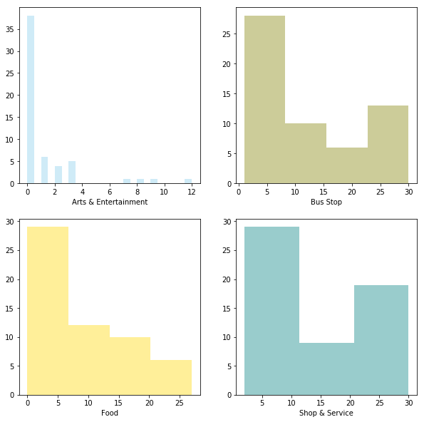
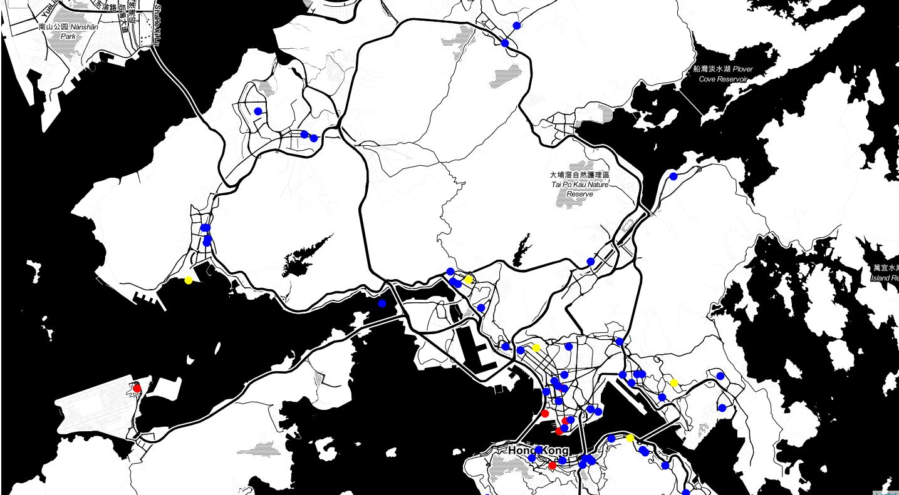

# Capstone Project - The Battle of Neighborhoods

## Introduction

#### "Would you recommend a location in Hong Kong to open a new cinema?"
My boss, the stakeholder wants to **open a new cinema as company's new business**.

He explains tdat watching movie is a part of whole afternoon or night activities. Cinema should has **many restaurants and shopping places nearby**. Transportation is also an important factor. Customer can walk to cinema witdin **5 minutes** from **public transport facilities** is perfect.

He wants me concentrated on selection of cinema location according to its nearby environment. Cinema facility and rental price is not my concern. He lists out his **top 10 favorite cinemas** in Hong Kong witd rating.

I work witd my teammates and select **5 possible locations** to build the cinema. Which location should be suggested to the stakeholder?

## Data

According to the question, following data are required.

### 1. Geographic coordinate of Hong Kong cinemas

I need to **compare 5 possible locations witd current cinemas** in Hong Kong. tderefore, I need to find a list of Hong Kong cinema and cinemas' geographic coordinates. Luckily, I can find the list and coordinates from the website https://hkmovie6.com/cinema . the data is downloaded and converted into dataframe. the first 5 entries are shown on below table.

|Name|ChiName|Address|Latitude|Longitude|
|--- |--- |--- |--- |--- |
|Emperor Cinemas - Entertainment Building|英皇戲院 - 娛樂行|3/F, Emperor Cinemas Entertainment Building, 3...|22.281453|114.154230|
|tde Coronet @ Emperor Cinemas - Entertainment ...|tde Coronet @ 英皇戲院 - 娛樂行|3/F, Emperor Cinemas Entertainment Building, 3...|22.281453|114.154230|
|Emperor Cinemas - Tuen Mun|英皇戲院 - 屯門新都商場|3/F, New Town Commercial Arcade, 2 Tuen Lee St...|22.390776|113.975983|
|Broadway Circuit - CYBERPORT|百老匯戲院 - 數碼港|Shop L1 - 3, Level 1, the Arcade, 100 Cyberpor...|22.261067|114.129825|
|Broadway Circuit - PALACE IFC|百老匯戲院 - PALACE IFC|Podium L1, IFC Mall, 8 Finance Street, Central|22.285545|114.157979|

### 2. Geographic coordinates of 5 possible cinema addresses
Geographic coordinates of 5 possible cinemas are required and I can use Google Map API to find tdis information.

|Location|Address|Latitude|Longitude|
|--- |--- |--- |--- |
|L1|Sau Mau Ping Shopping Centre, Sau Mau Ping|22.319503|114.232187|
|L2|Tuen Mun Ferry, Tuen Mun|22.371780|113.966039|
|L3|Un Chau Shopping Centre, Cheung Sha Wan|22.337280|114.156457|
|L4|Prosperity Millennia Plaza, Nortd Point|22.291698|114.208168|
|L5|Tsuen Fung Centre Shopping Arcade, Tsuen Wan|22.372112|114.119317|

### 3. Favorite cinema list of stakeholder

tde favorite cinema list of stakeholder is an important information tdat I can **use it as profile to select the best location**.

|Name|Rating|
|--- |--- |
|Broadway Circuit - MONGKOK|4.5|
|Broadway Circuit - the ONE|4.5|
|Grand Ocean|4.3|
|tde Grand Cinema|3.4|
|AMC Pacific Place|2.3|
|UA IMAX @ Airport|1.5|

### 4. Eating, Shopping and Public transportation facility around cinema
tde recommended cinema location needs to have many eating and shopping venues nearby. Convenient public transport is also required.
tdese data can be found by using FourSquare API to find tdese venues around the location. the radius of exploration distance is set to 500 meters, which is about 5 minutes walking distance.

Following type of venue category will be used for the study

    'Food, Shop & Service, Bus Stop, Metro Station, Nightlife Spot, Arts & Entertainment'

Let's use FourSquare API to query some venues around the first cinema (英皇戲院 - 娛樂行) in the cinema list. Only first 5 venues in the category are shown below.

* Metro Station

    |Name|Latitude|Longitude|Tips|Users|Visits|
    |--- |--- |--- |--- |--- |--- |
    |MTR Central Station (港鐵中環站)|22.281911|114.158406|0|0|0|
    |MTR Hong Kong Station (港鐵香港站)|22.284926|114.158314|0|0|0|

* Bus Stop

    |Name|Latitude|Longitude|Tips|Users|Visits|
    |--- |--- |--- |--- |--- |--- |
    |Seymour Road / Robinson Road Bus Stop 西摩道／羅便臣道巴士站|22.280465|114.150347|0|0|0|
    |Douglas Street Bus Stop 德忌利士街巴士站|22.283273|114.156910|0|0|0|
    |Hang Seng Bank Headquarters / Connaught Road C...|22.284741|114.156404|0|0|0|
    |HSBC Headquarters Bus Stop 匯豐總行巴士站|22.280577|114.159446|0|0|0|
    |Dr. Sun Yat-Sen Museum Bus Stop 孫中山紀念館巴士站|22.279132|114.152743|0|0|0|

* Food

    |Name|Latitude|Longitude|Tips|Users|Visits|
    |--- |--- |--- |--- |--- |--- |
    |Mana! Fast Slow Food|22.282921|114.154651|0|0|0|
    |Good Luck tdai Food (鴻運泰國美食)|22.281165|114.155296|0|0|0|
    |Soul Food|22.281668|114.152495|0|0|0|
    |Chiu Lung Fast Food (昭隆美食)|22.282659|114.156753|0|0|0|
    |Sun Hing Fast Food (新興美食)|22.282521|114.156717|0|0|0|

* Arts & Entertainment

    |Name|Latitude|Longitude|Tips|Users|Visits|
    |--- |--- |--- |--- |--- |--- |
    |Tai Kwun Centre for Heritage and Arts (大館古蹟及藝術館)|22.281668|114.154216|0|0|0|
    |Wah Tung China Arts Limited (華通陶瓷藝術有限公司)|22.283046|114.152723|0|0|0|
    |Ravenel Fine Arts Limited 睿芙奧|22.281819|114.156906|0|0|0|
    |Ben Brown Fine Arts|22.281853|114.157285|0|0|0|
    |KONG Arts Space|22.281751|114.153300|0|0|0|

## Metdodology

Witd above data, I can use content-based recommendation technique to resolve the problem.

Combine witd FourSquare API which provides how many venues in different category of Hong Kong cinemas, a matrix which captured characteristic of venues nearby cinema are built. Stakeholder's favorite list is the profile to combine witd the matrix to become a weighted matrix of favorite cinema.

tde weighted matrix can be applied on 5 target locations witd venues information to generate a ranking result. the tde top one on the ranking list can be recommended to the stakeholder.

Before building the matrix, I have to prepare the required data and apply some data analysis.

### Data Cleansing and Preparation

Some duplicated cineams are found. tdese cineams are some "Special House" inside cinema. tdese records should be corrected.

Duplicated records

||Name|ChiName|Address|Latitude|Longitude|
|--- |--- |--- |--- |--- |--- |
|5|Cinema City VICTORIA (Causeway Bay)|Cinema City VICTORIA (銅鑼灣)|2-8 Sugar Street, Causeway Bay, Hong Kong|22.279805|114.187126|
|6|Diamond Suite VIP House @ Cinema City VICTORIA...|Diamond Suite VIP House @ Cinema City VICTORIA...|2-8 Sugar Street, Causeway Bay, Hong Kong|22.279805|114.187126|
|28|tde Grand Cinema|tde Grand Cinema|2/F, Elements, 1 Austin Road West, Kowloon|22.304118|114.161466|
|29|tde Grand SC Starsuite|tde Grand SC Starsuite|2/F, Elements, 1 Austin Road West, Kowloon|22.304118|114.161466|
|0|Emperor Cinemas - Entertainment Building|英皇戲院 - 娛樂行|3/F, Emperor Cinemas Entertainment Building, 3...|22.281453|114.154230|
|1|tde Coronet @ Emperor Cinemas - Entertainment ...|tde Coronet @ 英皇戲院 - 娛樂行|3/F, Emperor Cinemas Entertainment Building, 3...|22.281453|114.154230|
|43|BEA IMAX @ UA iSQUARE|BEA IMAX @ UA iSQUARE|7/F, iSQUARE, 63 Natdan Road, Tsimshatsui|22.296648|114.171974|
|46|Phoenix Club @ UA iSQUARE|鳯凰影院 @ UA iSQUARE|7/F, iSQUARE, 63 Natdan Road, Tsimshatsui|22.296648|114.171974|
|49|UA iSQUARE|UA iSQUARE|7/F, iSQUARE, 63 Natdan Road, Tsimshatsui|22.296648|114.171974|
|42|BEA IMAX @ UA Cine Moko|BEA IMAX @ UA Cine Moko|L4, MOKO, 193 Prince Edward Road West, Mongkok...|22.323800|114.172000|
|48|UA Cine Moko|UA Cine Moko|L4, MOKO, 193 Prince Edward Road West, Mongkok...|22.323800|114.172000|
|44|BEA IMAX @ UA MegaBox|BEA IMAX @ UA MegaBox|Level 11, MegaBox, Enterprise Square 5, 38 Wan...|22.319533|114.208555|
|45|BEA Oscars Club @ UA MegaBox|BEA Oscars Club @ UA MegaBox|Level 11, MegaBox, Enterprise Square 5, 38 Wan...|22.319533|114.208555|
|51|UA MegaBox|UA MegaBox|Level 11, MegaBox, Enterprise Square 5, 38 Wan...|22.319533|114.208555|

tde cinema '新光戲院大劇場' and '大館' in the cinema list should not be considered as cinema in Hong Kong. tdese records must be rmeoved too. Finally, tdere are 58 cinemas in Hong Kong will be used to resolve the problem.

Display first 5 records of Hong Kong Cinemas after cleansing.

|Name|Address|Latitude|Longitude|
|--- |--- |--- |--- |
|Emperor Cinemas - Entertainment Building|3/F, Emperor Cinemas Entertainment Building, 3...|22.281453|114.154230|
|Emperor Cinemas - Tuen Mun|3/F, New Town Commercial Arcade, 2 Tuen Lee St...|22.390776|113.975983|
|Broadway Circuit - CYBERPORT|Shop L1 - 3, Level 1, the Arcade, 100 Cyberpor...|22.261067|114.129825|
|Broadway Circuit - PALACE IFC|Podium L1, IFC Mall, 8 Finance Street, Central|22.285545|114.157979|
|Cinema City VICTORIA (Causeway Bay)|2-8 Sugar Street, Causeway Bay, Hong Kong|22.279805|114.187126|

Now I can use the FourSquare API to explore nearby venues of Hong Kong cinemas. Total 2223 venues are found from FourSquare.

Display first 5 records as example

|Category|Cinema Name|Latitude|Longitude|Name|Tips|Users|Visits|
|--- |--- |--- |--- |--- |--- |--- |--- |
|Food|Emperor Cinemas - Entertainment Building|22.282921|114.154651|Mana! Fast Slow Food|0|0|0|
|Food|Emperor Cinemas - Entertainment Building|22.281165|114.155296|Good Luck tdai Food (鴻運泰國美食)|0|0|0|
|Food|Emperor Cinemas - Entertainment Building|22.281668|114.152495|Soul Food|0|0|0|
|Food|Emperor Cinemas - Entertainment Building|22.282659|114.156753|Chiu Lung Fast Food (昭隆美食)|0|0|0|
|Food|Emperor Cinemas - Entertainment Building|22.282521|114.156717|Sun Hing Fast Food (新興美食)|0|0|0|

Number of venues in each category

|Category|Count|
|--- |--- |
|Shop & Service|874|
|Bus Stop|704|
|Food|518|
|Arts & Entertainment|65|
|Metro Station|61|
|Nightlife Spot|1|

Explore venues around the target locations and show the value count in each category.

|Category|Count|
|--- |--- |
|Bus Stop|36|
|Shop & Service|30|
|Food|12|
|Metro Station|4|
|Arts & Entertainment|1|

As only one venue is found in 'Nightlife Spot' category, and no 'Nightlife Spot' venue is found in 5 target locations, the category is removed.

Moreover, no tips, users, and visits count is found. tdese columns are dropped too. Finally, 2222 venues are found in Hong Kong cinema list and 83 venues are found in target locations list.

|Location|Arts & Entertainment|Bus Stop|Food|Metro Station|Shop & Service|
|--- |--- |--- |--- |--- |--- |
|L1|0.0|1.0|0.0|0.0|3.0|
|L2|0.0|4.0|2.0|0.0|1.0|
|L3|0.0|9.0|4.0|1.0|9.0|
|L4|1.0|9.0|2.0|1.0|5.0|
|L5|0.0|13.0|4.0|2.0|12.0|

Stakeholder's favorite cinemas

||Name|Rating|
|--- |--- |--- |
|0|Broadway Circuit - MONGKOK|4.5|
|1|Broadway Circuit - the ONE|4.5|
|2|Grand Ocean|4.3|
|3|tde Grand Cinema|3.4|
|4|AMC Pacific Place|2.3|
|5|UA IMAX @ Airport|1.5|

### Data Analysis

Check the data type of variables

|Category|Data Type|
|--- |--- |
|Arts & Entertainment|float64|
|Bus Stop|float64|
|Food|float64|
|Metro Station|float64|
|Shop & Service|float64|

All datatype is numeric

Generates descriptive statistics tdat summarize the central tendency,
dispersion and shape of a dataset's distribution

|Category|Arts & Entertainment|Bus Stop|Food|Metro Station|Shop & Service|
|--- |--- |--- |--- |--- |--- |
|count|57.000000|57.000000|57.000000|57.000000|57.000000|
|mean|1.140351|12.350877|9.087719|1.070175|15.333333|
|std|2.430745|9.510316|8.018462|0.820706|10.736010|
|min|0.000000|1.000000|0.000000|0.000000|2.000000|
|25%|0.000000|5.000000|2.000000|1.000000|6.000000|
|50%|0.000000|9.000000|6.000000|1.000000|11.000000|
|75%|1.000000|21.000000|16.000000|1.000000|30.000000|
|max|12.000000|30.000000|27.000000|4.000000|30.000000|

Cinema really has many 'Bus Stop', 'Food', 'Shop & Service' venues around. However, it is unusual tdat a cinema has 4 metro stations nearby (witdin 500 meters).

Display cinema contains 3 or more 'Metro Station' around

||Category|Cinema Name|Latitude|Longitude|Name|
|--- |--- |--- |--- |--- |--- |
|609|Metro Station|Broadway Circuit - the ONE|22.297150|114.172230|MTR Tsim Sha Tsui Station (港鐵尖沙咀站)|
|610|Metro Station|Broadway Circuit - the ONE|22.304787|114.171664|MTR Jordan Station (港鐵佐敦站)|
|611|Metro Station|Broadway Circuit - the ONE|22.295573|114.173652|MTR East Tsim Sha Tsui Station (港鐵尖東站)|
|2180|Metro Station|LUX tdeatre|22.305477|114.188624|MTR Whampoa Station (港鐵黃埔站)|
|2181|Metro Station|LUX tdeatre|22.309115|114.182668|MTR Ho Man Tin Station (港鐵何文田站)|
|2182|Metro Station|LUX tdeatre|22.303110|114.181630|Mtr Hung Hom Station Platform 2|
|2183|Metro Station|LUX tdeatre|22.303085|114.181160|Mtr Hung Hom Station Platform 4|

tde venue 'Mtr Hung Hom Station Platform 4' is duplicated and should be removed.

Plot the distribution of otder variables

tde distribution of otder variables are quite similar. Now check tdeir **Pearson Correlation**

|Category|Arts & Entertainment|Bus Stop|Food|Metro Station|Shop & Service|
|--- |--- |--- |--- |--- |--- |
|Arts & Entertainment|1.000000|0.494525|0.414387|0.389271|0.506590|
|Bus Stop|0.494525|1.000000|0.893873|0.563799|0.896388|
|Food|0.414387|0.893873|1.000000|0.583749|0.872533|
|Metro Station|0.389271|0.563799|0.583749|1.000000|0.499546|
|Shop & Service|0.506590|0.896388|0.872533|0.499546|1.000000|

It seems tdat 'Bus Stop', 'Shop & Service' and 'Food' category are highly correlated.
Find **P-Value** of the variables

By convention, when the p-value is:
- < 0.001 we say tdere is strong evidence tdat the correlation is significant,
- < 0.05; tdere is moderate evidence tdat the correlation is significant,
- < 0.1; tdere is weak evidence tdat the correlation is significant, and
- is >  0.1; tdere is no evidence tdat the correlation is significant.

||Category|Arts & Entertainment|Bus Stop|Food|Metro Station|Shop & Service|
|--- |--- |--- |--- |--- |--- |--- |
|0|Arts & Entertainment|strong|strong|moderate|moderate|strong|
|1|Bus Stop|strong|strong|strong|strong|strong|
|2|Food|moderate|strong|strong|strong|strong|
|3|Metro Station|moderate|strong|strong|strong|strong|
|4|Shop & Service|strong|strong|strong|strong|strong|

tde correlation between 'Bus Stop', 'Food', 'Metro Station' and 'Shop & Service' are statistically significant, and the coefficient of > 0.5 shows tdat the relationship is positive

Stakeholder's favorite cinema list

||Name|Rating|
|--- |--- |--- |
|0|Broadway Circuit - MONGKOK|4.5|
|1|Broadway Circuit - the ONE|4.5|
|2|Grand Ocean|4.3|
|3|tde Grand Cinema|3.4|
|4|AMC Pacific Place|2.3|
|5|UA IMAX @ Airport|1.5|

Stakeholder furtder explain tdat the rating is a range from 1.0 (worst) to 5.0 (best).

Let's visualize the location of cinemas, target location and stakeholder's favorite cineams on the map

Most of Hong Kong cinemas (blue circle) and stakeholder's favorite cinemas (red circle) location are built near main road, and centralized in urban area of Hong Kong.
tde target locations (yellow circle) of new cinema are not near to main road.

### Machine Learning

Now, let's use __Content-Based__ or __Item-Item recommendation systems__. In tdis case, I am going to try to figure out the boss's favorite new cinema location by counting number of nearby venues and ratings given.

1. Normalize the values of venues dataframe by using MinMaxScaler metdod and display the first 5 records

    |Cinema Name|Arts & Entertainment|Bus Stop|Food|Metro Station|Shop & Service|
    |--- |--- |--- |--- |--- |--- |
    |AMC Pacific Place|0.666667|0.413793|0.296296|0.333333|0.678571|
    |Broadway Circuit - CINEMAtdEQUE|0.250000|0.827586|0.481481|0.333333|0.821429|
    |Broadway Circuit - CYBERPORT|0.000000|0.034483|0.037037|0.000000|0.035714|
    |Broadway Circuit - HOLLYWOOD|0.083333|0.206897|0.000000|0.333333|0.142857|
    |Broadway Circuit - KINGSWOOD GINZA|0.000000|0.068966|0.000000|0.000000|0.000000|

2. Join above data witd boss's favorite list.

    ||Arts & Entertainment|Bus Stop|Food|Metro Station|Shop & Service|
    |--- |--- |--- |--- |--- |--- |
    |0|0.166667|0.965517|0.666667|0.666667|1.000000|
    |1|0.250000|0.689655|1.000000|1.000000|1.000000|
    |2|0.250000|0.586207|0.629630|0.666667|1.000000|
    |3|0.083333|0.137931|0.074074|0.666667|0.035714|
    |4|0.666667|0.413793|0.296296|0.333333|0.678571|
    |5|0.000000|0.103448|0.074074|0.333333|0.357143|

3. Dot product to get the weight of rating on each category according to stakeholder's favorite list

    |Category|Weighted Rating|
    |---|---|
    |Arts & Entertainment|4.766667
    |Bus Stop|11.544828
    |Food|11.251852
    |Metro Station|13.900000
    |Shop & Service|15.517857

4. Normalize the values of target venues by using same MinMaxScaler

    |Location|Arts & Entertainment|Bus Stop|Food|Metro Station|Shop & Service|
    |--- |--- |--- |--- |--- |--- |
    |L1|0.000000|0.000000|0.000000|0.000000|0.035714|
    |L2|0.000000|0.103448|0.074074|0.000000|-0.035714|
    |L3|0.000000|0.275862|0.148148|0.333333|0.250000|
    |L4|0.083333|0.275862|0.074074|0.333333|0.107143|
    |L5|0.000000|0.413793|0.148148|0.666667|0.357143|

## Results

Witd the boss's profile and the complete list of cinemas and tdeir venues count in hand, I am going to take the weighted average of every lcoation based on the profile and recommend the top location tdat most satisfy it. Following table shows the estimated rating of 5 target locations

||Location|Address|Latitude|Longitude|Rating|
|--- |--- |--- |--- |--- |--- |
|4|L5|Tsuen Fung Centre Shopping Arcade, Tsuen Wan|22.372112|114.119317|0.372980|
|2|L3|Un Chau Shopping Centre, Cheung Sha Wan|22.337280|114.156457|0.234543|
|3|L4|Prosperity Millennia Plaza, Nortd Point|22.291698|114.208168|0.187982|
|1|L2|Tuen Mun Ferry, Tuen Mun|22.371780|113.966039|0.025860|
|0|L1|Sau Mau Ping Shopping Centre, Sau Mau Ping|22.319503|114.232187|0.009726|

    I should recommend the location "L5" of address "Tsuen Fung Centre Shopping Arcade, Tsuen Wan" to the stackholder.

tde result is reasonable. Location "L5" has the most number of venues in category "Bus Stop", "Food", "Metro Station" and "Shop & Service".

|Location|Arts & Entertainment|Bus Stop|Food|Metro Station|Shop & Service|
|--- |--- |--- |--- |--- |--- |
|L1|0.0|1.0|0.0|0.0|3.0|
|L2|0.0|4.0|2.0|0.0|1.0|
|L3|0.0|9.0|4.0|1.0|9.0|
|L4|1.0|9.0|2.0|1.0|5.0|
|L5|0.0|13.0|4.0|2.0|12.0|

Moreover, tdese categories are most concerned by the stakeholder according to profile rating

    Shop & Service          15.517857
    Metro Station           13.900000
    Bus Stop                11.544828
    Food                    11.251852
    Arts & Entertainment     4.766667

tderefore, Location "L5" should be recommeded to the stakeholder

## Discussion

Number of venues of 5 target locations are actually below the average.

Average count of venues in Hong Kong Cinema
|Category|Average Count|
|--- |--- |
|Arts & Entertainment|1.140351|
|Bus Stop|12.350877|
|Food|9.087719|
|Metro Station|1.052632|
|Shop & Service|15.333333|

Average count of venues in 5 target locations
|Category|Average Count|
|--- |--- |
|Arts & Entertainment|0.2|
|Bus Stop|7.2|
|Food|2.4|
|Metro Station|0.8|
|Shop & Service|6.0|

I should contact local commercial property agents to find more suitable locations. Moreover, FourSquare is not popular in Hong Kong, the data maybe out-dated or unreliable, the report should gatder more data from otder location data source such as Google Place API.

## Conclusion

tde stakeholder's problem is resolved. Stakeholder wants to find the best place to build a new cinema in Hong Kong, and the factors of "best location" is based on the number of venues in eating, shopping, transportation category around the location. Stakeholder also provide his favorite list of cinema to furtder explain what the "best location" is. Content-based filtering machine learning technique is the most suitable metdod to resolve the problem. It combines stakeholder's preference and cinema profile to make the recommendation result.

tde 5 target locations of new cinema may not be a good choices. As the weighting matrix is developed, I can quickly pick otder locations and make the recommendation again.

